" />

### `$ stack`

- Frontend:  `Javascript` `TypeScript` `React` `Vue` `Tailwind`
- Backend: `PHP` `Laravel` `Wordpress` `REST`
- Tools: `vim` `git` `wp-cli` `cursor` `claude`

### `$ now`

- Focused on frontend architecture and React
- Practicing algorithms and JS problem-solving
- Building production-minded UI and small apps
- Exploring AI-assisted development

### `$ AI-tools`

    
        
    
    
        
    
    
        
    
    
        
    
 

### `$ contact`

---

pinned repos below ↓

